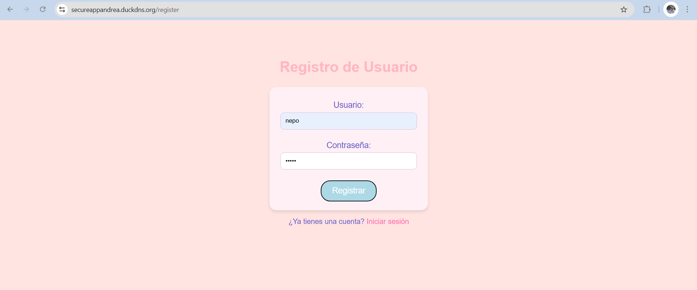
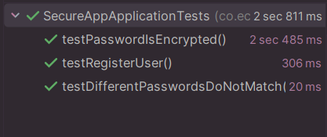

# Taller06AREP

## Descripción del Proyecto
Este proyecto implementa una aplicación basada en **Spring Boot** con una arquitectura segura y despliegue en **AWS**. La aplicación gestiona autenticación segura con contraseñas cifradas, conexión TLS y certificados de **Let's Encrypt**.

## Arquitectura de la Aplicación

### Componentes Clave

- **Cliente HTML + JavaScript**: Interfaz frontend asíncrona que se comunica con la API de Spring.
- **Spring Boot**: Back-end que maneja la autenticación y lógica.
- **Apache**: Servidor web que asegura la comunicación segura.
- **AWS**: Plataforma de despliegue con medidas de seguridad implementadas.

### Relación entre Componentes

1. El cliente envía solicitudes HTTP a Apache.
2. Apache redirige el tráfico al servicio de Spring Boot.
3. Spring Boot procesa la lógica y devuelve respuestas al cliente.
4. Todo el tráfico se cifra con TLS para mayor seguridad.

### Estrategia de Despliegue Seguro en AWS

- Configuración de **EC2**.


1. Crear una instancia EC2

2. Configurar el grupo de seguridad para permitir tráfico en los puertos:

 - 22 (SSH) → Solo para tu IP

- 80 (HTTP) → Abierto para todos

- 443 (HTTPS) → Abierto para todos
- 8443(puerto para la API) → abierto para todos

3. Acceder a la instancia:

Para pasarle la API a la maquina nos conectamos por sftp:

 ```sh
   sftp -i "secureApp.pem" ec2-user@ec2-52-23-203-236.compute-1.amazonaws.com
   ```

Mediante put y el archivo de la ruta:

 ```sh
    put C:\Users\andre\OneDrive\Escritorio\AREP\Taller06AREP\target\secureApp-0.0.1-SNAPSHOT.jar
   ```

Y para la consola por ssh

 ```sh
   ssh -i "secureApp.pem" ec2-user@ec2-52-23-203-236.compute-1.amazonaws.com
   ```

En este caso, se debe actualizar los paquetes y descargar la versión de java:

```sh
   sudo yum update -y
   sudo yum install java-21-amazon-corretto-devel
   ```

Ahora para que se ejecute el jar por debajo y que se pueda seguir usando la consola:

```sh
    nohup java -jar secureApp-0.0.1-SNAPSHOT.jar > output.log 2>&1 &
   ```

- Uso de **nginx** para manejar el tráfico de manera segura.

1. Actualizar paquetes e instalar NGINX

```sh
     sudo yum install nginx
   ```

2. Configurar NGINX como proxy inverso

Se crea un archivo de configuración

```sh
      sudo nano /etc/nginx/default.d/configuration.conf
   ```

Y se coloca lo siguiente:

```sh
      location / {
     proxy_pass http://localhost:8443;
     proxy_set_header Host $host;
     proxy_set_header X-Real-IP $remote_addr;
     proxy_set_header X-Forwarded-For $proxy_add_x_forwarded_for;
     proxy_set_header X-Forwarded-Proto $scheme;
 }
   ```

Guardar los cambios y salir (CTRL+X, Y, Enter).

y en el archivo de nginx.conf:

```sh
   sudo nginx -t
   sudo systemctl restart nginx
```

Probar la configuración y reiniciar NGINX

```sh
   # Settings for a TLS enabled server.

    server {
        listen       443 ssl;
        listen       [::]:443 ssl;
        http2        on;
        server_name  secureappandrea.duckdns.org;
        root         /usr/share/nginx/html;

        ssl_certificate /etc/letsencrypt/live/secureappandrea.duckdns.org/fullchain.pem;
        ssl_certificate_key /etc/letsencrypt/live/secureappandrea.duckdns.org/privkey.pem;
        ssl_session_cache shared:SSL:1m;
        ssl_session_timeout  10m;
        ssl_ciphers PROFILE=SYSTEM;
        ssl_prefer_server_ciphers on;

        # Load configuration files for the default server block.
        include /etc/nginx/default.d/*.conf;

        error_page 404 /404.html;
        location = /404.html {
        }

        error_page 500 502 503 504 /50x.html;
        location = /50x.html {
        }
    }


    server {

        listen       80;
        listen       [::]:80;
        server_name  secureappandrea.duckdns.org;

        return 301 https://$host$request_uri;

}
```

- Uso de **Let's Encrypt** para certificados SSL/TLS.

1. Instalar Certbot y el plugin para NGINX

```sh
   sudo yum install -y python3-pip augeas-libs
```

2. Obtener y configurar un certificado SSL

```sh
   sudo certbot --nginx -d secureappandrea.duckdns.org
```

3. Reiniciar Servicios

```sh
   sudo nginx -t
   sudo systemctl restart nginx
```

Finalmente, se puede ver en el video, el resultado final (se llama ).

## Implementación de Seguridad

- **Conexión segura**: Uso de TLS para cifrar la comunicación.
- **Autenticación segura**: Contraseñas almacenadas como hashes con **BCrypt**.
- **Certificados Let's Encrypt**: Implementados para HTTPS.

## Instrucciones de Despliegue

### Requisitos Previos

- Java 17+
- Maven
- AWS CLI configurado
- Certbot para Let's Encrypt

### Pasos

1. Clonar el repositorio:
   ```sh
   git clone https://github.com/Andrea2511/Taller06AREP.git
   cd Taller06AREP
   ```
2. Construir el proyecto con Maven:
   ```sh
   mvn clean package
   ```
3. Ejecutar la aplicación:
   ```sh
   java -jar target/taller06arep.jar
   ```
4. Acceder a https://localhost:8443

Viendose de la siguiente forma:





## Pruebas



## Autor

Andrea Valentina Torres Tobar


